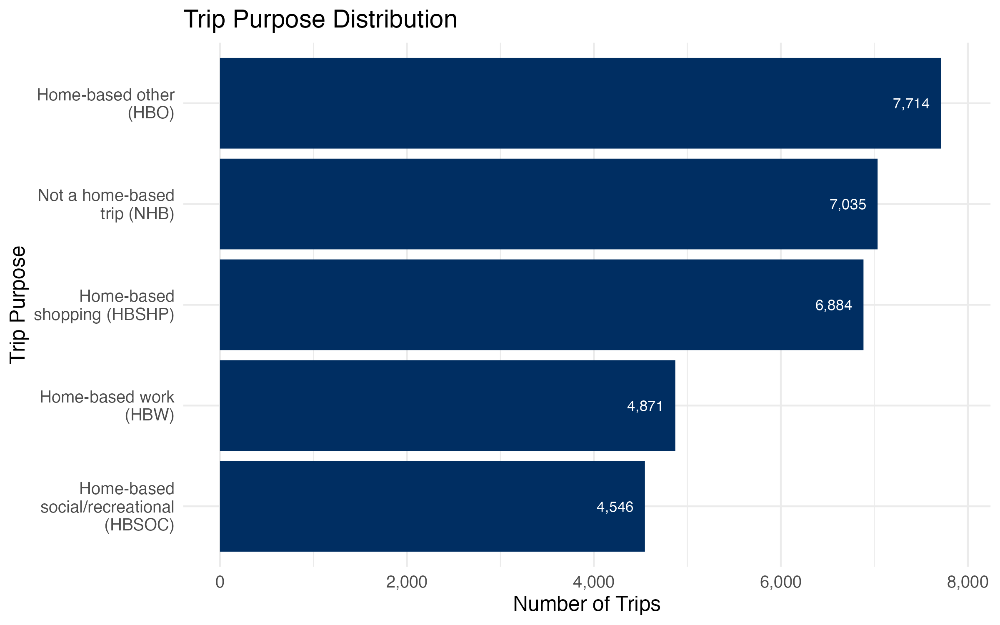
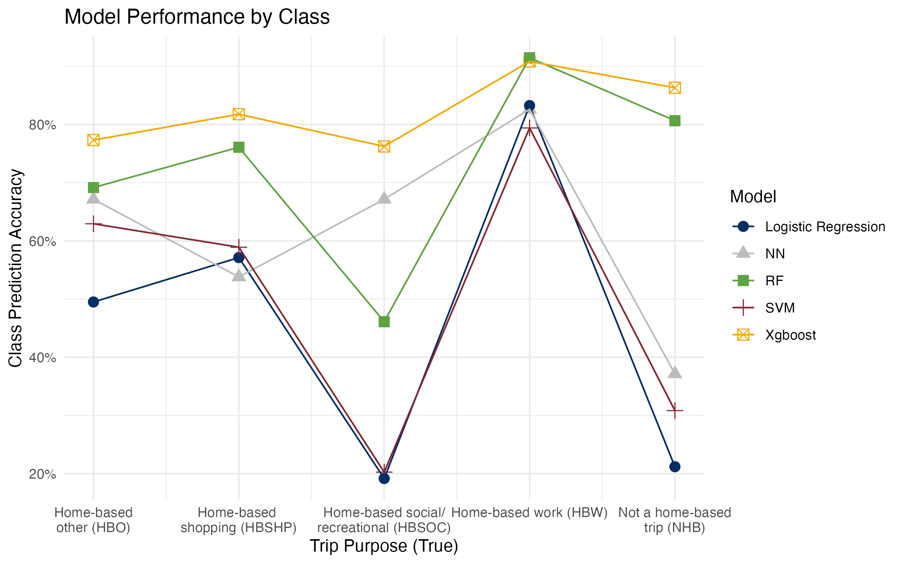
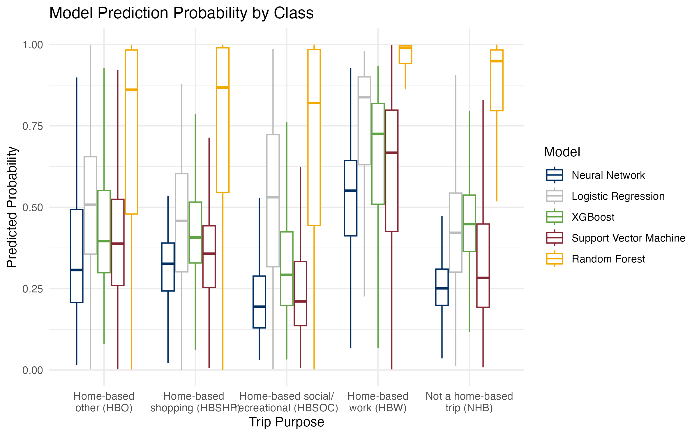
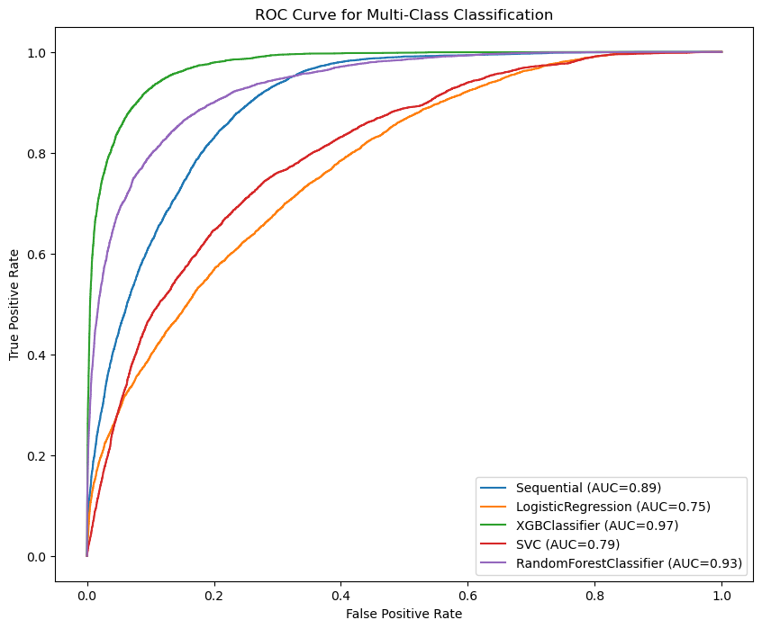
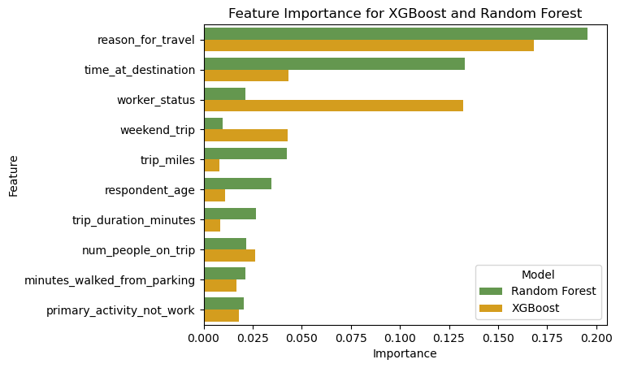

# Introduction

Americans are constantly taking trips by commuting to work, going to the store, visiting friends, or going on vacation. Understanding American travel patterns and why Americans travel can provide insights into fields ranging from environmental protection resource allocation to urban planning to economic trends. This statistical research is aimed at studying the travel behavior of the American population by predicting the purpose of trips.

# Data

In this study, we used data from the 2022 National Household Travel Survey (NHTS) collected by the U.S. Department of Transportation's Federal Highway Administration [-@fhwa2022nhts]. This survey data contains information on American individuals and households and their travel habits, including demographic information, modes of transportation, and the purpose for travel.

```{r trip-purpose, fig.cap="Support of trip purpose, the target variable for modeling.", echo=FALSE, out.width='85%', fig.align='center'}

```
<style>
p.caption {
  font-size: 20px;
  text-align: center;
  font-style: italic;
}
</style>

# Methods

In order to predict trip purposes, we trained various statistical learning models on a subset of the survey data and compared their performance.

### Data Preprocessing

Three features with high correlations to the target variable and four ID columns were removed from the data due to multicollinearity and lack of predictive power. Seven survey responses with no identified trip purposes were also removed. The remaining features were scaled and nominal predictors were encoded.

### Statistical Modeling

We trained five models on the preprocessed data: logistic regression, random forest, XGBoost, support vector machine, and neural network. All models were trained on 80% of the data, using cross validation to tune hyperparameters. Results were assessed using accuracy and ROC AUC.

# Results

The XGBoost model performs best on the test set with an accuracy of 0.8217 and an ROC AUC of 0.97. Despite hyperparameter tuning, results vary widely between models. Tree-based models perform best at predicting trip purposes.

```{r result_table, echo=FALSE}
results <- tibble::tibble(
  Model = c("Logistic Regression", "Random Forest", "XGBoost", "Support Vector Machine", "Neural Network"),
  Accuracy = c(0.4567, 0.7322, 0.8217, 0.5121, 0.5988),
  `ROC AUC` = c(0.75, 0.93, 0.97, 0.81, 0.89)
) |>
  dplyr::arrange(desc(Accuracy))

knitr::kable(results)
```

```{r model-performance-by-class, echo=FALSE, fig.cap="Model predictive performance for each target class.", out.width='88%', fig.align='center'}

```

```{r model-prediction-certainty-by-class, echo=FALSE, fig.cap="Distribution of prediction probabilities by target class.", out.width='90%', fig.align='center'}

```

```{r roc-auc, echo=FALSE, fig.cap="Multiclass receiver operating characteristic curve for all models.", out.width='88%', fig.align='center'}

```

```{r feature-importance, echo=FALSE, fig.cap="Feature importance of the tree-based models", out.width='100%', fig.align='center'}

```

# Conclusions

Based on this study, we can see that tree-based methods, especially XGBoost, have the best results for predicting trip purpose from NHTS data in 2022. The most important features in this model include the reason for travel, the trip destination, and whether the trip occurred over the weekend. Our ability to predict trip purpose with high accuracy and ROC AUC suggests that trip purpose is explainable by trip characteristics and demographic information.

Future work could include predicting trip purpose on past NHTS survey data to see how travel behavior has changed over time and implementing different feature selection techniques to improve model performance.

# References
