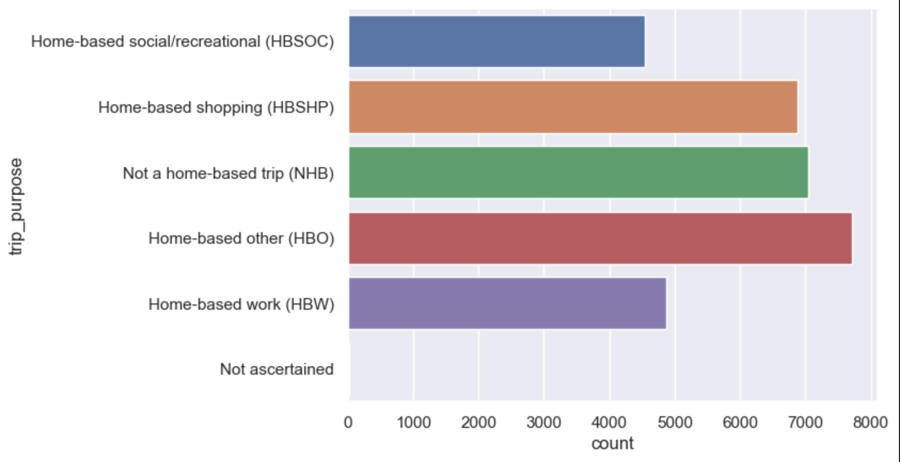
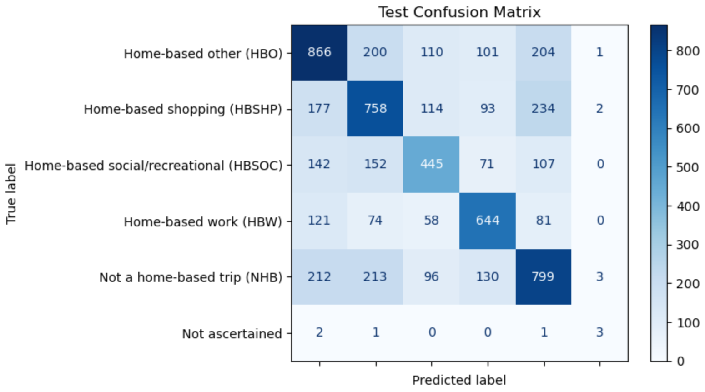

# 1 Introduction

In this project we will be studying trips taken by individuals and attempting to predict the trip's purpose. Trip purpose is significant in many fields ranging from Environmental protection resource allocation to urban planning and development. 

# 2 Data

In this study we used data from the National Household Travel Survey (NHTS) collected by the National Highway Administration. This data contains information on trips taken for many purposes by the American public. It is one of the only data sources that allows users to analyze household trips based on household and person level information. 

# 3 Modeling

In order to determine the best model for predicting trip purposes, we trained a variety of statistical learning models on the data. First we will discuss each model trained and then we will go over the results and best model.

### Logistic Regression

### Random Forest

### Support Vector Machine (SVM)

Our best SVM model used a learning rate C of 10 and a polynomial kernel. It has an accuracy of ~53.3%.

### XGBoost

Our best xgboost model had parameters subsample = 0.6, number of estimators = 300, max_depth = 9, learning_rate = 0.1, gamma = 0, and colsample_bytre = 1.0. It achieved an accuracy rate of ~63%.

### Nueral Net 

# 4 Results

Visualize results

# 5 Conclusions

Draw conclusions

# References

Federal Highway Administration. (2022). 2022 NextGen NHTS National Passenger OD Data, U.S. Department of Transportation, Washington, DC. Available online: https://nhts.ornl.gov/od/.

