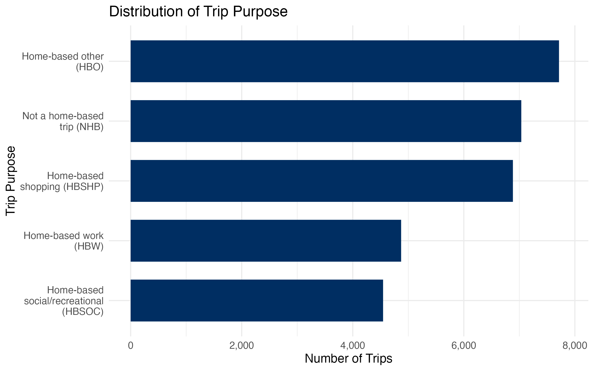
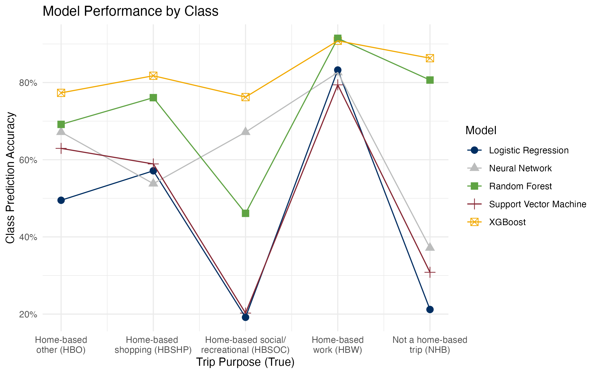
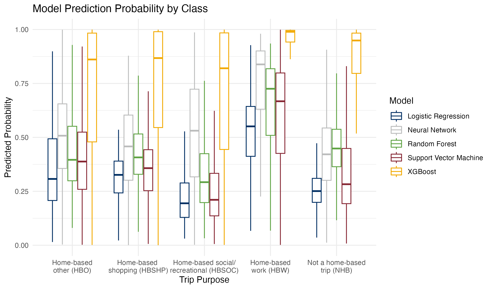

# 1 Introduction

Americans are constantly taking trips by commuting, going to the store, visiting friends, or going on vacation. Understanding American travel patterns and why Americans travel can provide insights into fields ranging from environmental protection resource allocation to urban planning to economic trends. This statistical research is aimed at studying the travel behavior of the American population by predicting the purpose of trips.

# 2 Data

In this study, we used data from the 2022 National Household Travel Survey (NHTS) collected by the U.S. Department of Transportation Federal Highway Administration [@fhwa2022nhts]. This survey data contains information on American individuals and households and their travel habits, including demographic information, modes of transportation, and the purpose for travel \@ref(fig:trip-purpose).

```{r trip-purpose, fig.cap="Support of trip purpose, the target variable for modeling", echo=FALSE, out.width='80%', fig.align='center'}

```

# 3 Methods

In order to determine the best model for predicting trip purposes, we trained a 5 statistical learning models on a subset of the survey data. 

### Data Preprocessing

Three features with high correlations to the target variable and four ID columns were removed from the data due to multicollinearity and lack of predictive power. Seven survey responses with no identified trip purpose were removed. The remaining features were scaled and nominal predictors were encoded.

### Statistical Modeling

We trained five models on the preprocessed data: logistic regression, random forest, xgboost, support vector machine, and neural network. All models were trained on 80% of the data, using cross validation to tune hyperparameters.


### XGBoost

Our best xgboost model had parameters subsample = 0.6, number of estimators = 300, max_depth = 9, learning_rate = 0.1, gamma = 0, and colsample_bytre = 1.0. It achieved an accuracy rate of \~63%.


# 4 Results

{width=70%}

{width=70%}

{width=70%}


| Model | Accuracy  | ROC AUC |
|------------------------|----------------|---------|
| Logistic Regression | 0.4567 | 0.75 |
| Random Forest | 0.7322 | 0.93 |
| XGBoost | 0.8217 | 0.97 |
| Support Vector Machine | 0.5121 | 0.79 |
| Neural Network | 0.5988 | 0.89 |

# 5 Conclusions

Based on this study, we can see that the XGBoost classifier has the best testing accuracy of 0.8116. The most important features in this model are reason for travel and worker status. Hopefully this model can be used in the future to inform those who wish to study American's movements based on this data.

# References
