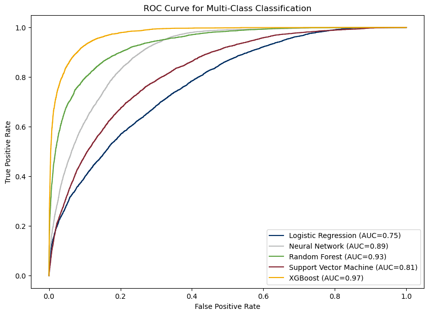

# 1 Introduction

Americans are constantly taking trips by commuting, going to the store, visiting friends, or going on vacation. Understanding American travel patterns and why Americans travel can provide insights into fields ranging from environmental protection resource allocation to urban planning to economic trends. This statistical research is aimed at studying the travel behavior of the American population by predicting the purpose of trips.

# 2 Data

In this study, we used data from the 2022 National Household Travel Survey (NHTS) collected by the U.S. Department of Transportation Federal Highway Administration. This survey data contains information on American individuals and households and their travel habits, including demographic information, modes of transportation, and the purpose for travel. It is one of the only data sources that allows users to analyze American travel behaviors based on household and person level information.

# 3 Methods

In order to determine the best model for predicting trip purposes, we trained a variety of statistical learning models on the data. Features with high correlations to the target variable were removed to prevent multicollinearity.

### Logistic Regression

### Random Forest

Our Random forest model had the parameters min_sample_split = 3, max_depth ranging from 2 to 15 and n *estimators = 100. The accuracy was 0.499 for a max*\_depth of 2 and 0.759 for a max_depth of 15.

{width="396"}

### XGBoost

Our best xgboost model had parameters subsample = 0.6, number of estimators = 300, max_depth = 9, learning_rate = 0.1, gamma = 0, and colsample_bytre = 1.0. It achieved an accuracy rate of \~63%.

## Logistic Regression

### Support Vector Machine (SVM)

Our best SVM model used a learning rate C of 10 and a polynomial kernel. It has an accuracy of \~53.3%.

### Multilayer Perceptron

# 4 Results

| Model                  | Accuracy       | ROC AUC |
|------------------------|----------------|---------|
| Logistic Regression    | 0.4576         | 0.75    |
| Random Forest          | 0.499 to 0.759 | ??      |
| XGBoost                | 0.8116         | 0.97    |
| Support Vector Machine | 0.5111         | 0.79    |
| Multilayer Perceptron  | 0.5771         | 0.89    |

# 5 Conclusions

Draw conclusions

# References

Federal Highway Administration. (2022). 2022 NextGen NHTS National Passenger OD Data, U.S. Department of Transportation, Washington, DC. Available online: <https://nhts.ornl.gov/od/>.
